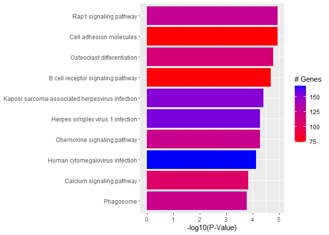

<script>
function buildQuiz(myq, qc){
  // variable to store the HTML output
  const output = [];

  // for each question...
  myq.forEach(
    (currentQuestion, questionNumber) => {

      // variable to store the list of possible answers
      const answers = [];

      // and for each available answer...
      for(letter in currentQuestion.answers){

        // ...add an HTML radio button
        answers.push(
          `<label>
            <input type="radio" name="question${questionNumber}" value="${letter}">
            ${letter} :
            ${currentQuestion.answers[letter]}
          </label><br/>`
        );
      }

      // add this question and its answers to the output
      output.push(
        `<div class="question"> ${currentQuestion.question} </div>
        <div class="answers"> ${answers.join('')} </div><br/>`
      );
    }
  );

  // finally combine our output list into one string of HTML and put it on the page
  qc.innerHTML = output.join('');
}

function showResults(myq, qc, rc){

  // gather answer containers from our quiz
  const answerContainers = qc.querySelectorAll('.answers');

  // keep track of user's answers
  let numCorrect = 0;

  // for each question...
  myq.forEach( (currentQuestion, questionNumber) => {

    // find selected answer
    const answerContainer = answerContainers[questionNumber];
    const selector = `input[name=question${questionNumber}]:checked`;
    const userAnswer = (answerContainer.querySelector(selector) || {}).value;

    // if answer is correct
    if(userAnswer === currentQuestion.correctAnswer){
      // add to the number of correct answers
      numCorrect++;

      // color the answers green
      answerContainers[questionNumber].style.color = 'lightgreen';
    }
    // if answer is wrong or blank
    else{
      // color the answers red
      answerContainers[questionNumber].style.color = 'red';
    }
  });

  // show number of correct answers out of total
  rc.innerHTML = `${numCorrect} out of ${myq.length}`;
}
</script>


# GO AND KEGG Enrichment Analysis

Load libraries

``` r
library(topGO)
library(org.Mm.eg.db)
library(clusterProfiler)
library(pathview)
library(enrichplot)
library(ggplot2)
library(dplyr)
```

Files for examples were created in the DE analysis.

## Gene Ontology (GO) Enrichment

[Gene ontology](http://www.geneontology.org/) provides a controlled vocabulary for describing biological processes (BP ontology), molecular functions (MF ontology) and cellular components (CC ontology)

The GO ontologies themselves are organism-independent; terms are associated with genes for a specific organism through direct experimentation or through sequence homology with another organism and its GO annotation.

Terms are related to other terms through parent-child relationships in a directed acylic graph.

Enrichment analysis provides one way of drawing conclusions about a set of differential expression results.

**1\.** topGO Example Using Kolmogorov-Smirnov Testing
Our first example uses Kolmogorov-Smirnov Testing for enrichment testing of our mouse DE results, with GO annotation obtained from the Bioconductor database org.Mm.eg.db.

The first step in each topGO analysis is to create a topGOdata object.  This contains the genes, the score for each gene (here we use the p-value from the DE test), the GO terms associated with each gene, and the ontology to be used (here we use the biological process ontology)

``` r
infile <- "WT.C_v_WT.NC.txt"
DE <- read.delim(infile)

## Add entrezgene IDs to top table
tmp <- bitr(DE$Gene.stable.ID, fromType = "ENSEMBL", toType = "ENTREZID", OrgDb = org.Mm.eg.db)
```

```
## 'select()' returned 1:many mapping between keys and columns
```

```
## Warning in bitr(DE$Gene.stable.ID, fromType = "ENSEMBL", toType = "ENTREZID", :
## 6.93% of input gene IDs are fail to map...
```

``` r
id.conv <- subset(tmp, !duplicated(tmp$ENSEMBL))
DE <- left_join(DE, id.conv, by = c("Gene.stable.ID" = "ENSEMBL"))

# Make gene list
DE.nodupENTREZ <- subset(DE, !is.na(ENTREZID) & !duplicated(ENTREZID))
geneList <- DE.nodupENTREZ$P.Value
names(geneList) <- DE.nodupENTREZ$ENTREZID
head(geneList)
```

```
##        67241        68891        12772        70686       219140        94212 
## 5.518511e-19 2.310858e-18 4.609451e-18 5.554266e-17 8.138953e-17 8.504872e-17
```

``` r
# Create topGOData object
GOdata <- new("topGOdata",
	ontology = "BP",
	allGenes = geneList,
	geneSelectionFun = function(x)x,
	annot = annFUN.org , mapping = "org.Mm.eg.db")
```

```
## 
## Building most specific GOs .....
```

```
## 	( 10608 GO terms found. )
```

```
## 
## Build GO DAG topology ..........
```

```
## 	( 13703 GO terms and 30140 relations. )
```

```
## 
## Annotating nodes ...............
```

```
## 	( 10477 genes annotated to the GO terms. )
```

**2\.** The topGOdata object is then used as input for enrichment testing:

``` r
# Kolmogorov-Smirnov testing
resultKS <- runTest(GOdata, algorithm = "weight01", statistic = "ks")
```

```
## 
## 			 -- Weight01 Algorithm -- 
## 
## 		 the algorithm is scoring 13703 nontrivial nodes
## 		 parameters: 
## 			 test statistic: ks
## 			 score order: increasing
```

```
## 
## 	 Level 19:	2 nodes to be scored	(0 eliminated genes)
```

```
## 
## 	 Level 18:	25 nodes to be scored	(0 eliminated genes)
```

```
## 
## 	 Level 17:	51 nodes to be scored	(39 eliminated genes)
```

```
## 
## 	 Level 16:	92 nodes to be scored	(108 eliminated genes)
```

```
## 
## 	 Level 15:	127 nodes to be scored	(209 eliminated genes)
```

```
## 
## 	 Level 14:	245 nodes to be scored	(473 eliminated genes)
```

```
## 
## 	 Level 13:	564 nodes to be scored	(839 eliminated genes)
```

```
## 
## 	 Level 12:	1010 nodes to be scored	(1422 eliminated genes)
```

```
## 
## 	 Level 11:	1548 nodes to be scored	(2566 eliminated genes)
```

```
## 
## 	 Level 10:	1817 nodes to be scored	(4354 eliminated genes)
```

```
## 
## 	 Level 9:	2013 nodes to be scored	(6008 eliminated genes)
```

```
## 
## 	 Level 8:	1909 nodes to be scored	(7351 eliminated genes)
```

```
## 
## 	 Level 7:	1666 nodes to be scored	(8220 eliminated genes)
```

```
## 
## 	 Level 6:	1324 nodes to be scored	(8898 eliminated genes)
```

```
## 
## 	 Level 5:	812 nodes to be scored	(9267 eliminated genes)
```

```
## 
## 	 Level 4:	376 nodes to be scored	(9503 eliminated genes)
```

```
## 
## 	 Level 3:	104 nodes to be scored	(9628 eliminated genes)
```

```
## 
## 	 Level 2:	17 nodes to be scored	(9656 eliminated genes)
```

```
## 
## 	 Level 1:	1 nodes to be scored	(9703 eliminated genes)
```

``` r
tab <- GenTable(GOdata, raw.p.value = resultKS, topNodes = length(resultKS@score), numChar = 120)
```

topGO by default preferentially tests more specific terms, utilizing the topology of the GO graph. The algorithms used are described in detail [here](https://academic.oup.com/bioinformatics/article/22/13/1600/193669).


``` r
head(tab, 15)
```

```
##         GO.ID
## 1  GO:0045944
## 2  GO:0045071
## 3  GO:0032760
## 4  GO:0032731
## 5  GO:0001525
## 6  GO:0035458
## 7  GO:0045766
## 8  GO:0070374
## 9  GO:0006002
## 10 GO:0045087
## 11 GO:0035556
## 12 GO:0140242
## 13 GO:0032956
## 14 GO:0051897
## 15 GO:0140236
##                                                                                         Term
## 1                                  positive regulation of transcription by RNA polymerase II
## 2                                            negative regulation of viral genome replication
## 3                                    positive regulation of tumor necrosis factor production
## 4                                       positive regulation of interleukin-1 beta production
## 5                                                                               angiogenesis
## 6                                                       cellular response to interferon-beta
## 7                                                        positive regulation of angiogenesis
## 8                                               positive regulation of ERK1 and ERK2 cascade
## 9                                                     fructose 6-phosphate metabolic process
## 10                                                                    innate immune response
## 11                                                         intracellular signal transduction
## 12                                                                translation at postsynapse
## 13                                             regulation of actin cytoskeleton organization
## 14 positive regulation of phosphatidylinositol 3-kinase/protein kinase B signal transduction
## 15                                                                 translation at presynapse
##    Annotated Significant Expected raw.p.value
## 1        800         800      800     6.1e-09
## 2         51          51       51     2.5e-08
## 3         97          97       97     7.9e-08
## 4         54          54       54     1.5e-07
## 5        324         324      324     2.9e-07
## 6         54          54       54     3.4e-07
## 7         99          99       99     4.2e-07
## 8        103         103      103     1.8e-06
## 9         12          12       12     2.9e-06
## 10       708         708      708     5.2e-06
## 11      1971        1971     1971     5.9e-06
## 12        46          46       46     8.1e-06
## 13       230         230      230     9.3e-06
## 14       103         103      103     1.2e-05
## 15        45          45       45     1.2e-05
```

* Annotated: number of genes (in our gene list) that are annotated with the term
* Significant: n/a for this example, same as Annotated here
* Expected: n/a for this example, same as Annotated here
* raw.p.value: P-value from Kolomogorov-Smirnov test that DE p-values annotated with the term are smaller (i.e. more significant) than those not annotated with the term.

The Kolmogorov-Smirnov test directly compares two probability distributions based on their maximum distance.  

To illustrate the KS test, we plot probability distributions of p-values that are and that are not annotated with the term GO:0010556 "regulation of macromolecule biosynthetic process" (2344 genes) p-value 1.00.  (This won't exactly match what topGO does due to their elimination algorithm):


``` r
rna.pp.terms <- genesInTerm(GOdata)[["GO:0010556"]] # get genes associated with term
p.values.in <- geneList[names(geneList) %in% rna.pp.terms]
p.values.out <- geneList[!(names(geneList) %in% rna.pp.terms)]
plot.ecdf(p.values.in, verticals = T, do.points = F, col = "red", lwd = 2, xlim = c(0,1),
          main = "Empirical Distribution of DE P-Values by Annotation with 'regulation of macromolecule biosynthetic process'",
          cex.main = 0.9, xlab = "p", ylab = "Probability(P-Value <= p)")
ecdf.out <- ecdf(p.values.out)
xx <- unique(sort(c(seq(0, 1, length = 201), knots(ecdf.out))))
lines(xx, ecdf.out(xx), col = "black", lwd = 2)
legend("bottomright", legend = c("Genes Annotated with 'regulation of macromolecule biosynthetic process'", "Genes not annotated with 'regulation of macromolecule biosynthetic process'"), lwd = 2, col = 2:1, cex = 0.9)
```

<!-- -->

versus the probability distributions of p-values that are and that are not annotated with the term GO:0045071 "negative regulation of viral genome replication" (54 genes) p-value 3.3x10-9.


``` r
rna.pp.terms <- genesInTerm(GOdata)[["GO:0045071"]] # get genes associated with term
p.values.in <- geneList[names(geneList) %in% rna.pp.terms]
p.values.out <- geneList[!(names(geneList) %in% rna.pp.terms)]
plot.ecdf(p.values.in, verticals = T, do.points = F, col = "red", lwd = 2, xlim = c(0,1),
          main = "Empirical Distribution of DE P-Values by Annotation with 'negative regulation of viral genome replication'",
          cex.main = 0.9, xlab = "p", ylab = "Probability(P-Value <= p)")
ecdf.out <- ecdf(p.values.out)
xx <- unique(sort(c(seq(0, 1, length = 201), knots(ecdf.out))))
lines(xx, ecdf.out(xx), col = "black", lwd = 2)
legend("bottomright", legend = c("Genes Annotated with 'negative regulation of viral genome replication'", "Genes Not Annotated with 'negative regulation of viral genome replication'"), lwd = 2, col = 2:1, cex = 0.9)
```

<!-- -->


We can use the function showSigOfNodes to plot the GO graph for the 2 most significant terms and their parents, color coded by enrichment p-value (red is most significant):

``` r
par(cex = 0.3)
showSigOfNodes(GOdata, score(resultKS), firstSigNodes = 2, useInfo = "def", .NO.CHAR = 40)
```

```
## Loading required package: Rgraphviz
```

```
## Loading required package: grid
```

```
## 
## Attaching package: 'grid'
```

```
## The following object is masked from 'package:topGO':
## 
##     depth
```

```
## 
## Attaching package: 'Rgraphviz'
```

```
## The following objects are masked from 'package:IRanges':
## 
##     from, to
```

```
## The following objects are masked from 'package:S4Vectors':
## 
##     from, to
```

<!-- -->

```
## $dag
## A graphNEL graph with directed edges
## Number of Nodes = 50 
## Number of Edges = 106 
## 
## $complete.dag
## [1] "A graph with 50 nodes."
```

``` r
par(cex = 1)
```

**3\.** topGO Example Using Fisher's Exact Test

Next, we use Fisher's exact test to test for GO enrichment among significantly DE genes.

Create topGOdata object:

``` r
geneList <- DE.nodupENTREZ$adj.P.Val
names(geneList) <- DE.nodupENTREZ$ENTREZID

# Create topGOData object
GOdata <- new("topGOdata",
	ontology = "BP",
	allGenes = geneList,
	geneSelectionFun = function(x) (x < 0.05),
	annot = annFUN.org , mapping = "org.Mm.eg.db")
```

```
## 
## Building most specific GOs .....
```

```
## 	( 10608 GO terms found. )
```

```
## 
## Build GO DAG topology ..........
```

```
## 	( 13703 GO terms and 30140 relations. )
```

```
## 
## Annotating nodes ...............
```

```
## 	( 10477 genes annotated to the GO terms. )
```

Run Fisher's Exact Test:

``` r
resultFisher <- runTest(GOdata, algorithm = "elim", statistic = "fisher")
```

```
## 
## 			 -- Elim Algorithm -- 
## 
## 		 the algorithm is scoring 12186 nontrivial nodes
## 		 parameters: 
## 			 test statistic: fisher
## 			 cutOff: 0.01
```

```
## 
## 	 Level 19:	2 nodes to be scored	(0 eliminated genes)
```

```
## 
## 	 Level 18:	21 nodes to be scored	(0 eliminated genes)
```

```
## 
## 	 Level 17:	45 nodes to be scored	(8 eliminated genes)
```

```
## 
## 	 Level 16:	82 nodes to be scored	(8 eliminated genes)
```

```
## 
## 	 Level 15:	111 nodes to be scored	(26 eliminated genes)
```

```
## 
## 	 Level 14:	205 nodes to be scored	(61 eliminated genes)
```

```
## 
## 	 Level 13:	464 nodes to be scored	(357 eliminated genes)
```

```
## 
## 	 Level 12:	860 nodes to be scored	(479 eliminated genes)
```

```
## 
## 	 Level 11:	1328 nodes to be scored	(1920 eliminated genes)
```

```
## 
## 	 Level 10:	1610 nodes to be scored	(2302 eliminated genes)
```

```
## 
## 	 Level 9:	1784 nodes to be scored	(2944 eliminated genes)
```

```
## 
## 	 Level 8:	1732 nodes to be scored	(3741 eliminated genes)
```

```
## 
## 	 Level 7:	1518 nodes to be scored	(4483 eliminated genes)
```

```
## 
## 	 Level 6:	1215 nodes to be scored	(5243 eliminated genes)
```

```
## 
## 	 Level 5:	740 nodes to be scored	(6306 eliminated genes)
```

```
## 
## 	 Level 4:	354 nodes to be scored	(6861 eliminated genes)
```

```
## 
## 	 Level 3:	97 nodes to be scored	(7022 eliminated genes)
```

```
## 
## 	 Level 2:	17 nodes to be scored	(7107 eliminated genes)
```

```
## 
## 	 Level 1:	1 nodes to be scored	(7142 eliminated genes)
```

``` r
tab <- GenTable(GOdata, raw.p.value = resultFisher, topNodes = length(resultFisher@score),
				numChar = 120)
head(tab)
```

```
##        GO.ID                                                       Term
## 1 GO:0001525                                               angiogenesis
## 2 GO:0007204 positive regulation of cytosolic calcium ion concentration
## 3 GO:0007165                                        signal transduction
## 4 GO:0032731       positive regulation of interleukin-1 beta production
## 5 GO:0045944  positive regulation of transcription by RNA polymerase II
## 6 GO:0032760    positive regulation of tumor necrosis factor production
##   Annotated Significant Expected raw.p.value
## 1       324         225   163.62     1.6e-07
## 2        77          60    38.89     6.3e-07
## 3      3123        1817  1577.15     1.1e-06
## 4        54          44    27.27     2.3e-06
## 5       800         464   404.01     5.8e-06
## 6        97          70    48.99     1.1e-05
```
* Annotated: number of genes (in our gene list) that are annotated with the term
* Significant: Number of significantly DE genes annotated with that term (i.e. genes where geneList = 1)
* Expected: Under random chance, number of genes that would be expected to be significantly DE and annotated with that term
* raw.p.value: P-value from Fisher's Exact Test, testing for association between significance and pathway membership.

Fisher's Exact Test is applied to the table:

**Significance/Annotation**|**Annotated With GO Term**|**Not Annotated With GO Term**
:-----:|:-----:|:-----:
**Significantly DE**|n1|n3
**Not Significantly DE**|n2|n4

and compares the probability of the observed table, conditional on the row and column sums, to what would be expected under random chance.  

Advantages over KS (or Wilcoxon) Tests:

* Ease of interpretation

* Can be applied when you just have a gene list without associated p-values, etc.

Disadvantages:

* Relies on significant/non-significant dichotomy (an interesting gene could have an adjusted p-value of 0.051 and be counted as non-significant)
* Less powerful
* May be less useful if there are very few (or a large number of) significant genes

## Quiz 1

<div id="quiz1" class="quiz"></div>
<button id="submit1">Submit Quiz</button>
<div id="results1" class="output"></div>
<script>
quizContainer1 = document.getElementById('quiz1');
resultsContainer1 = document.getElementById('results1');
submitButton1 = document.getElementById('submit1');

myQuestions1 = [
  {
    question: "Rerun the KS test analysis using the molecular function (MF) ontology.  What is the top GO term listed?",
    answers: {
      a: "calcium ion binding",
      b: "angiogenesis",
      c: "calcium ion binding"
    },
    correctAnswer: "a"
  },
  {
      question: "How many genes from the top table are annotated with the term 'actin filament binding'",
    answers: {
      a: "150",
      b: "5,846",
      c: "133"
    },
    correctAnswer: "c"
  },
  {
      question: "Based on the graph above generated by showSigOfNodes, what is one parent term of 'negative regulation of viral genome replication'?",
    answers: {
      a: "metabolic process",
      b: "regulation of viral genome replication",
      c: "angiogenesis"
    },
    correctAnswer: "b"
  }
];

buildQuiz(myQuestions1, quizContainer1);
submitButton1.addEventListener('click', function() {showResults(myQuestions1, quizContainer1, resultsContainer1);});
</script>

## KEGG Pathway Enrichment Testing With clusterProfiler

KEGG, the Kyoto Encyclopedia of Genes and Genomes (https://www.genome.jp/kegg/), provides assignment of genes for many organisms into pathways.

We will conduct KEGG enrichment testing using the Bioconductor package [clusterProfiler](https://doi.org/10.1016/j.xinn.2021.100141). clusterProfiler implements an algorithm very similar to that used by [GSEA](https://www.gsea-msigdb.org/gsea/index.jsp).

Cluster profiler can do much more than KEGG enrichment, check out the [clusterProfiler book](https://yulab-smu.top/biomedical-knowledge-mining-book/index.html).

We will base our KEGG enrichment analysis on the t statistics from differential expression, which allows for directional testing.


``` r
geneList.KEGG <- DE.nodupENTREZ$t                   
geneList.KEGG <- sort(geneList.KEGG, decreasing = TRUE)
names(geneList.KEGG) <- DE.nodupENTREZ$ENTREZID
head(geneList.KEGG)
```

```
##    67241    68891    12772    70686   219140    94212 
## 40.72759 39.08710 32.14372 31.47893 29.40610 29.38849
```


``` r
set.seed(99)
KEGG.results <- gseKEGG(gene = geneList.KEGG, organism = "mmu", pvalueCutoff = 1)
```

```
## Reading KEGG annotation online: "https://rest.kegg.jp/link/mmu/pathway"...
```

```
## Reading KEGG annotation online: "https://rest.kegg.jp/list/pathway/mmu"...
```

```
## using 'fgsea' for GSEA analysis, please cite Korotkevich et al (2019).
```

```
## preparing geneSet collections...
```

```
## GSEA analysis...
```

```
## leading edge analysis...
```

```
## done...
```

``` r
KEGG.results <- setReadable(KEGG.results, OrgDb = "org.Mm.eg.db", keyType = "ENTREZID")
outdat <- as.data.frame(KEGG.results)
head(outdat)
```

```
##                ID                                     Description setSize
## mmu04514 mmu04514                         Cell adhesion molecules      74
## mmu04015 mmu04015                          Rap1 signaling pathway     125
## mmu04380 mmu04380                      Osteoclast differentiation     113
## mmu04662 mmu04662               B cell receptor signaling pathway      75
## mmu05167 mmu05167 Kaposi sarcoma-associated herpesvirus infection     151
## mmu04062 mmu04062                     Chemokine signaling pathway     122
##          enrichmentScore      NES       pvalue     p.adjust       qvalue rank
## mmu04514       0.6190383 2.193009 6.147516e-08 1.151476e-05 7.123299e-06 1257
## mmu04015       0.5356389 2.056773 7.086005e-08 1.151476e-05 7.123299e-06 2197
## mmu04380       0.5459626 2.072437 1.551850e-07 1.681171e-05 1.040012e-05 2226
## mmu04662       0.5944450 2.111142 2.550558e-07 2.072328e-05 1.281991e-05 2203
## mmu05167       0.4875951 1.928343 5.961922e-07 3.875249e-05 2.397320e-05 1525
## mmu04062       0.5115253 1.961990 1.063325e-06 5.244683e-05 3.244484e-05 2197
##                            leading_edge
## mmu04514 tags=34%, list=12%, signal=30%
## mmu04015 tags=49%, list=20%, signal=39%
## mmu04380 tags=42%, list=20%, signal=34%
## mmu04662 tags=49%, list=20%, signal=40%
## mmu05167 tags=31%, list=14%, signal=27%
## mmu04062 tags=43%, list=20%, signal=35%
##                                                                                                                                                                                                                                                                                                                                                                 core_enrichment
## mmu04514                                                                                                                                                                                                                   Vcan/Spn/Cd274/Sell/Itgal/L1cam/Itgb1/Itgb2/Vsir/H2-Q6/Pecam1/Jaml/Pdcd1lg2/H2-K1/H2-Q7/H2-Q4/H2-D1/Siglec1/Itgav/H2-T24/Cd22/H2-Ob/Cadm3/Cdh1/Itgb7
## mmu04015 Plcb1/Sipa1l1/Tiam1/Met/Adcy7/Thbs1/Itgal/Itgb1/Itgb2/Calm1/Afdn/Rassf5/Raf1/Rap1b/Pdgfb/Gnaq/Vasp/Evl/Rasgrp2/Vegfc/Rras/Sipa1l3/Insr/P2ry1/Prkd2/Prkcb/Actg1/Fpr1/Rapgef5/Map2k1/Pik3cd/Pfn1/Hgf/Rap1a/Rapgef1/Apbb1ip/Csf1r/Rhoa/Cdh1/Rac1/Tln1/Adora2a/Fgfr1/Kras/Adcy4/Akt1/Lcp2/Crk/Itgb3/Mapk3/Pdgfrb/Ralb/Rgs14/Plcb3/Fyb1/Arap3/Akt3/Calml4/Pik3r2/Adcy9/Vav3
## mmu04380                                                                     Pparg/Lilra6/Lilra5/Fyn/Fcgr4/Stat2/Itpr1/Pira11/Tgfbr1/Acp5/Sirpd/Tyk2/Pirb/Ncf1/Map3k14/Mitf/Tgfbr2/Pira2/Nfkb1/Itpr3/Fcgr1/Map2k1/Pik3cd/Spi1/Socs3/Pira1/Trem2/Sqstm1/Csf1r/Pira6/Rac1/Fos/Ppp3r1/Nfatc1/Lilrb4b/Akt1/Nfkbia/Lcp2/Itgb3/Mapk3/Gab2/Sirpb1a/Chuk/Akt3/Tab2/Pik3r2/Fcgr2b/Ifngr1
## mmu04662                                                                                                                                       Lilra6/Lilra5/Pik3ap1/Nfatc3/Raf1/Cd81/Pira11/Pirb/Ptpn6/Cd79a/Pira2/Prkcb/Nfkb1/Cd22/Map2k1/Ifitm1/Pik3cd/Pira1/Cd19/Pira6/Rac1/Fos/Ppp3r1/Nfatc1/Kras/Lilrb4b/Akt1/Nfkbia/Blk/Mapk3/Nfkbie/Chuk/Akt3/Pik3r2/Inppl1/Vav3/Fcgr2b
## mmu05167                                                                                       C3/Pik3r6/Rcan1/Tcf7l2/Nfatc3/H2-Q6/Calm1/Gng2/Stat2/Raf1/Itpr1/Pdgfb/Tyk2/E2f2/H2-K1/H2-Q7/Rb1/Ccr1/Il6st/H2-Q4/H2-D1/Gngt2/Traf3/Hck/H2-T24/Nfkb1/Ikbke/Eif2ak2/Itpr3/Stat3/Map2k1/Pik3cd/Irf7/Casp8/Gnb1/Rac1/Fos/Ppp3r1/Jak2/Irf3/Nfatc1/Hif1a/Kras/Cdk6/Akt1/Nfkbia/Cd200r1
## mmu04062                                                           Ccr2/Plcb1/Tiam1/Pik3r6/Adcy7/Grk3/Ccl9/Ptk2b/Gng2/Stat2/Ccl6/Raf1/Rap1b/Gnaq/Cxcr4/Rasgrp2/Ccr1/Ncf1/Gngt2/Cxcl10/Prkcb/Hck/Nfkb1/Stat5b/Stat3/Map2k1/Pik3cd/Ccl2/Rap1a/Gnb1/Rhoa/Gsk3a/Rac1/Jak2/Bad/Kras/Adcy4/Akt1/Fgr/Nfkbia/Crk/Mapk3/Elmo1/Prkacb/Plcb3/Gng10/Chuk/Akt3/Grk2/Cx3cr1/Pik3r2/Adcy9/Vav3
```

Gene set enrichment analysis output includes the following columns:

* setSize: Number of genes in pathway

* enrichmentScore: [GSEA enrichment score](https://www.gsea-msigdb.org/gsea/doc/GSEAUserGuideTEXT.htm#_Enrichment_Score_(ES)), a statistic reflecting the degree to which a pathway is overrepresented at the top or bottom of the gene list (the gene list here consists of the t-statistics from the DE test).

* NES: [Normalized enrichment score](https://www.gsea-msigdb.org/gsea/doc/GSEAUserGuideTEXT.htm#_Normalized_Enrichment_Score)

* pvalue: Raw p-value from permutation test of enrichment score

* p.adjust: Benjamini-Hochberg false discovery rate adjusted p-value

* qvalue: Storey false discovery rate adjusted p-value 

* rank: Position in ranked list at which maximum enrichment score occurred

* leading_edge: [Statistics from leading edge analysis](https://www.gsea-msigdb.org/gsea/doc/GSEAUserGuideTEXT.htm#_Detailed_Enrichment_Results)

### Dotplot of enrichment results
Gene.ratio = (count of core enrichment genes)/(count of pathway genes)

Core enrichment genes = subset of genes that contribute most to the enrichment result ("leading edge subset")


``` r
dotplot(KEGG.results)
```

<!-- -->

### Pathview plot of log fold changes on KEGG diagram


``` r
foldChangeList <- DE$logFC
xx <- as.list(org.Mm.egENSEMBL2EG)
names(foldChangeList) <- xx[sapply(strsplit(DE$Gene,split="\\."),"[[", 1L)]
head(foldChangeList)
```

```
##     67241     68891     12772     70686    219140     94212 
## -2.474865  4.558642  2.171072 -4.109923 -2.668725 -1.888581
```

``` r
mmu04015 <- pathview(gene.data  = foldChangeList,
                     pathway.id = "mmu04015",
                     species    = "mmu",
                     limit      = list(gene=max(abs(foldChangeList)), cpd=1))
```

```
## 'select()' returned 1:1 mapping between keys and columns
```

```
## Info: Working in directory C:/Users/bpdurbin/OneDrive - University of California, Davis/work_stuff/2025-June-RNA-Seq-Analysis/data_analysis
```

```
## Info: Writing image file mmu04015.pathview.png
```


### Barplot of p-values for top pathways
A barplot of -log10(p-value) for the top pathways/terms can be used for any type of enrichment analysis.


``` r
plotdat <- outdat[1:10,]
plotdat$nice.name <- gsub(" - Mus musculus (house mouse)", "", plotdat$Description, fixed = TRUE)

ggplot(plotdat, aes(x = -log10(p.adjust), y = reorder(nice.name, -log10(p.adjust)), fill = setSize)) + geom_bar(stat = "identity") + labs(x = "-log10(P-Value)", y = NULL, fill = "# Genes") + scale_fill_gradient(low = "red", high = "blue")
```

<!-- -->
## Quiz 2

<div id="quiz2" class="quiz"></div>
<button id="submit2">Submit Quiz</button>
<div id="results2" class="output"></div>
<script>
quizContainer2 = document.getElementById('quiz2');
resultsContainer2 = document.getElementById('results2');
submitButton2 = document.getElementById('submit2');

myQuestions2 = [
  {
    question: "How many pathways have an adjusted p-value less than 0.05?",
    answers: {
      a: "118",
      b: "325",
      c: "134"
    },
    correctAnswer: "a"
  },
  {
      question: "Which pathway has the most genes annotated to it?'",
    answers: {
      a: "Ribosome",
      b: "Arginine biosynthesis",
      c: "Pathways of neurodegeneration - multiple diseases"
    },
    correctAnswer: "c"
  },
  {
      question: "Make a pathview diagram for mmu05171, and locate the file mmu05171.pathview.png on your computer.  What sign does the log fold change for MAPK have?",
    answers: {
      a: "Positive",
      b: "Negative"
    },
    correctAnswer: "b"
  }
];

buildQuiz(myQuestions2, quizContainer2);
submitButton2.addEventListener('click', function() {showResults(myQuestions2, quizContainer2, resultsContainer2);});
</script>


``` r
sessionInfo()
```

```
## R version 4.5.0 (2025-04-11 ucrt)
## Platform: x86_64-w64-mingw32/x64
## Running under: Windows 11 x64 (build 26100)
## 
## Matrix products: default
##   LAPACK version 3.12.1
## 
## locale:
## [1] LC_COLLATE=English_United States.utf8 
## [2] LC_CTYPE=English_United States.utf8   
## [3] LC_MONETARY=English_United States.utf8
## [4] LC_NUMERIC=C                          
## [5] LC_TIME=English_United States.utf8    
## 
## time zone: America/Los_Angeles
## tzcode source: internal
## 
## attached base packages:
## [1] grid      stats4    stats     graphics  grDevices utils     datasets 
## [8] methods   base     
## 
## other attached packages:
##  [1] Rgraphviz_2.52.0       dplyr_1.1.4            ggplot2_3.5.2         
##  [4] enrichplot_1.28.2      pathview_1.48.0        clusterProfiler_4.16.0
##  [7] org.Mm.eg.db_3.21.0    topGO_2.59.0           SparseM_1.84-2        
## [10] GO.db_3.21.0           AnnotationDbi_1.70.0   IRanges_2.42.0        
## [13] S4Vectors_0.46.0       Biobase_2.68.0         graph_1.86.0          
## [16] BiocGenerics_0.54.0    generics_0.1.4        
## 
## loaded via a namespace (and not attached):
##  [1] bitops_1.0-9            DBI_1.2.3               gson_0.1.0             
##  [4] rlang_1.1.6             magrittr_2.0.3          DOSE_4.2.0             
##  [7] matrixStats_1.5.0       compiler_4.5.0          RSQLite_2.3.11         
## [10] png_0.1-8               vctrs_0.6.5             reshape2_1.4.4         
## [13] stringr_1.5.1           pkgconfig_2.0.3         crayon_1.5.3           
## [16] fastmap_1.2.0           XVector_0.48.0          labeling_0.4.3         
## [19] rmarkdown_2.29          KEGGgraph_1.68.0        UCSC.utils_1.4.0       
## [22] purrr_1.0.4             bit_4.6.0               xfun_0.52              
## [25] cachem_1.1.0            aplot_0.2.5             GenomeInfoDb_1.44.0    
## [28] jsonlite_2.0.0          blob_1.2.4              BiocParallel_1.42.0    
## [31] parallel_4.5.0          R6_2.6.1                bslib_0.9.0            
## [34] stringi_1.8.7           RColorBrewer_1.1-3      jquerylib_0.1.4        
## [37] GOSemSim_2.34.0         Rcpp_1.0.14             knitr_1.50             
## [40] snow_0.4-4              ggtangle_0.0.6          R.utils_2.13.0         
## [43] Matrix_1.7-3            splines_4.5.0           igraph_2.1.4           
## [46] tidyselect_1.2.1        qvalue_2.40.0           yaml_2.3.10            
## [49] codetools_0.2-20        lattice_0.22-6          tibble_3.2.1           
## [52] plyr_1.8.9              withr_3.0.2             treeio_1.32.0          
## [55] KEGGREST_1.48.0         evaluate_1.0.3          gridGraphics_0.5-1     
## [58] Biostrings_2.76.0       pillar_1.10.2           ggtree_3.16.0          
## [61] ggfun_0.1.8             RCurl_1.98-1.17         scales_1.4.0           
## [64] tidytree_0.4.6          glue_1.8.0              lazyeval_0.2.2         
## [67] tools_4.5.0             data.table_1.17.4       fgsea_1.34.0           
## [70] XML_3.99-0.18           fs_1.6.6                fastmatch_1.1-6        
## [73] cowplot_1.1.3           tidyr_1.3.1             ape_5.8-1              
## [76] nlme_3.1-168            GenomeInfoDbData_1.2.14 patchwork_1.3.0        
## [79] cli_3.6.5               gtable_0.3.6            R.methodsS3_1.8.2      
## [82] yulab.utils_0.2.0       sass_0.4.10             digest_0.6.37          
## [85] ggrepel_0.9.6           ggplotify_0.1.2         org.Hs.eg.db_3.21.0    
## [88] farver_2.1.2            memoise_2.0.1           htmltools_0.5.8.1      
## [91] R.oo_1.27.1             lifecycle_1.0.4         httr_1.4.7             
## [94] bit64_4.6.0-1
```
